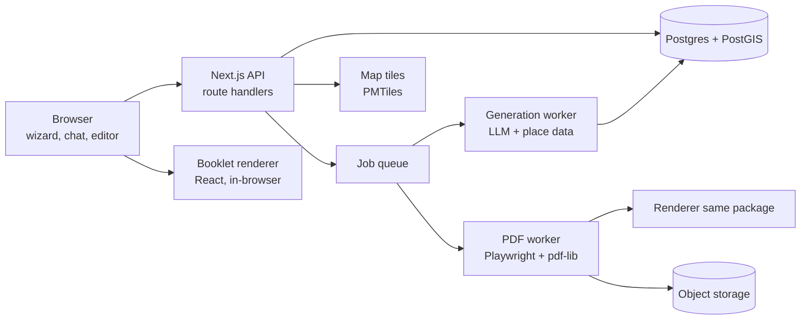
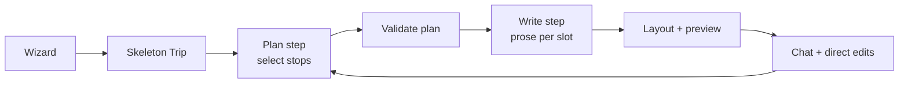
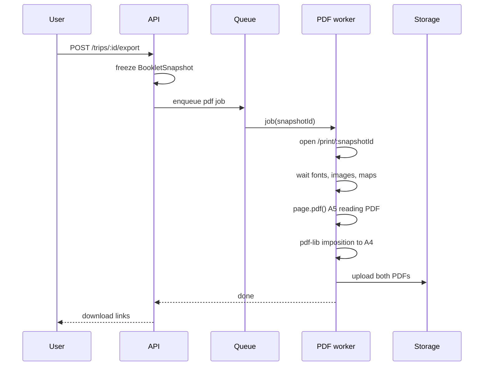

# Travel Zine Generator — Claude Code Implementation Spec

2026-09-21 · @Someone

## 1. Overview

We are building a web service that turns a traveler's short city-trip plan into a magazine-style, home-printable A5 booklet (PDF). Visual references: Huan Nguyen's *Travel* zine series (Issue #01 Hong Kong, Issue #02 Japan).

### 1.1 Product in one paragraph

The user sketches a trip in a wizard (city, dates, pace, interests, must-see places), refines it in chat, and the AI fills gaps and writes editorial copy. A live A5 preview shows the real booklet. The user tweaks it directly (remove, swap, reorder, edit blurbs, replace photos). One click produces two PDFs: a reading PDF (A5 pages in order) and a print PDF (A4, duplex, imposed in booklet order, to fold and staple).

### 1.2 MVP scope (locked decisions)

| Area | Decision |
| --- | --- |
| When used | Before the trip; small notes areas included |
| Physical form | Folded A5 booklet from home-printed A4; PDF only |
| Trip scope | One city, 1–5 days, 8–20 pages (multiple of 4) |
| Beachhead user | Design-conscious solo travelers and couples |
| Plan origin | Hybrid: user sketches, AI fills and writes |
| Input | Wizard + chat |
| Day structure | Time-of-day blocks: morning, afternoon, evening |
| Editing | Live preview + light direct manipulation + chat for bigger changes |
| Themes | Hybrid: curated for popular cities, generated for others; one token schema |
| Layout | Template variants per spread type, fixed slots with text budgets |
| Images | Open-licensed photos + optional user uploads |
| Maps | OSM-based styled maps + QR codes per place and per day |
| Place data | Open data (OSM / Overture) + LLM for prose only |
| Languages | Booklet in English or Ukrainian; decorative local-script echoes |
| Rendering | HTML/CSS/React, PDF via headless Chrome, imposition via pdf-lib |
| Business | Freemium; per-trip unlock |
| Validation | EN + UA landing page, waitlist, go at 200 organic sign-ups in 4 weeks |

### 1.3 Non-goals for MVP

- Post-trip keepsake mode, print-on-demand shipping, multi-city or multi-country trips.
- Import from Google Maps lists or Wanderlog.
- Group collaboration, gift mode beyond a dedication line, B2B / white label.
- Exact-time scheduling, bookings, real-time availability, commercial place APIs.
- Native mobile apps.

### 1.4 How Claude Code should use this doc

- Treat section 1.2 as fixed. Do not re-open those decisions without flagging it.
- Build in the order of section 17. Each phase has acceptance criteria; stop and report when a phase is done.
- Types in section 3 are the contract between packages. Change them deliberately and update this doc.
- Two hard rules override convenience everywhere: the LLM never invents places or facts (section 5), and preview and PDF come from the same renderer (section 11).

## 2. Architecture

One TypeScript monorepo: a Next.js web app, a shared booklet renderer package used by both the browser preview and the PDF worker, and background workers for generation and PDF output.



The browser preview and the PDF worker import the same `@zine/booklet` package, so the preview is the print output.

### 2.1 Stack

| Layer | Choice | Notes |
| --- | --- | --- |
| Language | TypeScript (strict) everywhere | Shared types in `@zine/core` |
| Web app | Next.js (App Router), React 19 | SSR for landing; client app for editor |
| Styling | CSS Modules + CSS custom properties | Theme tokens become CSS variables |
| State (editor) | Zustand + Immer; command pattern for undo | See section 10 |
| Validation | Zod schemas mirroring core types | Also used for LLM structured output |
| DB | Postgres 16 + PostGIS; Drizzle ORM | Places cache, trips, booklets |
| Queue | pg-boss (Postgres-backed) | No extra infra for MVP |
| LLM | Anthropic API (Claude), structured JSON outputs | Model names in config, not code |
| Maps | MapLibre GL JS + Protomaps PMTiles (OSM) | Self-hosted tiles on object storage |
| PDF | Playwright (Chromium) + pdf-lib | Worker container |
| Images | sharp | Resize, grayscale, duotone |
| QR | `qrcode` npm package, SVG output | Vector in PDF |
| Storage | S3-compatible (Cloudflare R2) | PDFs, uploads, tiles, processed images |
| Auth | Magic link email (Auth.js or Lucia-style) | Guest mode before sign-up |
| Payments | Stripe Checkout (one-time payments) | Per-trip unlock |
| Hosting | Vercel for web; Fly.io or Railway for workers | Workers need Chromium |
| Observability | Sentry + structured logs + PostHog | Funnel analytics |

### 2.2 Repo layout

```
/apps
  /web            Next.js app: landing, wizard, chat, editor, API routes
  /worker         Node service: generation jobs + PDF jobs
/packages
  /core           Domain types, Zod schemas, pure logic (pagination, budgets)
  /booklet        React spread components, variants, theme CSS, fonts
  /layout         Variant selection, text fitting, page assembly
  /places         OSM/Overture ingestion, search, scoring
  /ai             Prompts, LLM client, structured output parsing, guards
  /themes         Token schema, curated themes, generator, grayscale check
  /imaging        Image search, licensing metadata, processing
  /pdf            Playwright rendering, pdf-lib imposition
  /i18n           UI strings (en, uk), echo vocabulary cache
/tools
  /ingest         CLI to build a city's place dataset
  /theme-lab      Local page to preview all variants x themes
```

### 2.3 Key architectural rules

1. **Data model is the single source of truth.** Pages are derived from `Trip` + `BookletContent` + `Theme`. Nobody edits pages directly.
2. **Pure layout.** `@zine/layout` is a pure function: `(content, theme, fontMetrics) => PageSpec[]`. Deterministic for the same input.
3. **Renderer is dumb.** `@zine/booklet` renders a `PageSpec[]` and never decides layout.
4. **Facts vs prose.** Addresses, coordinates, hours, and place IDs come only from `@zine/places`. The LLM supplies only prose and selections from given candidate IDs.
5. **Every PDF is reproducible** from a stored `BookletSnapshot` (content + theme + renderer version).

## 3. Domain data model

Four aggregates drive everything: `Trip` (the plan), `BookletContent` (the words and images), `Theme` (the look), and `PageSpec[]` (the derived layout). These types live in `@zine/core`.

```ts
// ---------- Trip (the plan) ----------
type Locale = 'en' | 'uk';
type Pace = 'relaxed' | 'balanced' | 'packed';
type BlockSlot = 'morning' | 'afternoon' | 'evening';

interface Trip {
  id: string;
  ownerId: string | null;          // null = guest session
  cityId: string;                  // references City
  locale: Locale;                  // booklet language
  startDate: string | null;        // ISO date; null = undated trip
  dayCount: number;                // 1..5 for MVP
  pace: Pace;
  interests: string[];             // tag ids, e.g. 'food-markets', 'architecture'
  avoid: string[];                 // tag ids, e.g. 'museums'
  travelers: 'solo' | 'couple';
  notes: string;                   // free-text preferences from wizard/chat
  days: Day[];
  mustSeePlaceIds: string[];
  dedication?: string;             // optional line on the cover
  status: 'draft' | 'generated' | 'unlocked';
  createdAt: string; updatedAt: string;
}

interface Day {
  index: number;                   // 0-based
  title: string;                   // e.g. "Tiles and viewpoints"
  neighborhoods: string[];
  blocks: Record<BlockSlot, Stop[]>; // 0..3 stops per block
}

interface Stop {
  id: string;
  placeId: string;                 // MUST exist in places table
  source: 'user' | 'ai';
  locked: boolean;                 // user-pinned: AI may not remove or move
}

// ---------- Places (facts, never from LLM) ----------
interface Place {
  id: string;                      // stable internal id
  osmId?: string; overtureId?: string;
  cityId: string;
  names: { local: string; en?: string; uk?: string };
  category: PlaceCategory;         // cafe, restaurant, viewpoint, museum, park, shop, sight, bar, market
  lat: number; lon: number;
  address?: string;
  openingHours?: string;           // raw OSM opening_hours; printed only if present
  website?: string;
  confidence: number;              // 0..1 from Overture / heuristics
  lastSeenAt: string;
  tags: string[];                  // derived interest tags
}

// ---------- Content (prose + media, per trip) ----------
interface Field<T = string> {
  value: T;
  origin: 'ai' | 'user';
  locked: boolean;                 // true once user edits; AI must not overwrite
}

interface BookletContent {
  tripId: string;
  cover: { headline: Field; deck: Field; imageId: Field<string | null> };
  intro: { headline: Field; body: Field; pullQuote: Field };
  days: DayContent[];
  places: Record<string, PlaceContent>; // keyed by placeId
  practical: { transport: Field; money: Field; tips: Field };
  colophon: { credits: ImageCredit[] };
}

interface DayContent { dayIndex: number; headline: Field; intro: Field; }
interface PlaceContent { placeId: string; blurb: Field; imageId: Field<string | null>; }

// ---------- Theme ----------
interface Theme {
  id: string;
  kind: 'curated' | 'generated';
  cityId: string | null;
  version: number;
  tokens: ThemeTokens;             // see section 6
  echoes: EchoVocabulary;          // local-script strings, see section 6
}

// ---------- Layout output ----------
interface PageSpec {
  index: number;                   // 0-based reading order
  spreadType: SpreadType;
  variantId: string;               // e.g. 'day.3stops.photoTop'
  side: 'left' | 'right';
  slots: Record<string, SlotContent>;
}

type SlotContent =
  | { kind: 'text'; ref: FieldRef; text: string; fits: boolean; overflowChars: number }
  | { kind: 'image'; imageId: string | null; focal: [number, number] }
  | { kind: 'map'; mapSpec: MapSpec }
  | { kind: 'qr'; url: string; label: string }
  | { kind: 'notes'; lines: number };

interface BookletSnapshot {
  id: string; tripId: string;
  content: BookletContent; theme: Theme; trip: Trip;
  pages: PageSpec[];
  rendererVersion: string;
  createdAt: string;
}
```

### 3.1 Database tables

| Table | Key columns | Notes |
| --- | --- | --- |
| `users` | id, email, locale, created\_at | Magic link auth |
| `sessions` | id, user\_id, expires\_at | Guest sessions have user\_id null |
| `cities` | id, slug, names jsonb, country, bbox geometry, tz, curated\_theme\_id | Seeded by ingest CLI |
| `places` | id, city\_id, osm\_id, overture\_id, names jsonb, category, geom point, hours, confidence, tags text\[\] | GIST index on geom |
| `trips` | id, owner\_id, city\_id, payload jsonb, status, unlocked | Trip as jsonb, versioned |
| `booklet_contents` | trip\_id, payload jsonb, version | Optimistic concurrency via version |
| `themes` | id, kind, city\_id, tokens jsonb, echoes jsonb, version |  |
| `images` | id, source, source\_url, license, author, width, height, processed\_key | Includes uploads |
| `snapshots` | id, trip\_id, payload jsonb, pdf\_read\_key, pdf\_print\_key | Immutable |
| `chat_messages` | id, trip\_id, role, content, tool\_calls jsonb |  |
| `purchases` | id, user\_id, trip\_id, stripe\_session\_id, amount, status |  |
| `waitlist` | id, email, locale, source, utm jsonb, created\_at | Landing page |
| `jobs` | managed by pg-boss |  |

Store `Trip` and `BookletContent` as versioned jsonb documents. Relational columns exist only for what we query or join on.

## 4. Planning flow: wizard, chat, AI pipeline

The wizard builds a structured skeleton in about 60 seconds; the AI drafts the full plan and copy; chat refines. Target: first preview on screen under 30 seconds after the wizard ends.



Chat edits re-enter the plan step only for affected days; untouched and locked content is kept.

### 4.1 Wizard steps

1. **City.** Search over `cities` (only cities with an ingested dataset). Shows a note if a curated theme exists.
2. **Dates or length.** Date range or "undated, N days" (1–5). Free tier is capped at 2 days; show the lock inline, don't block.
3. **Who and pace.** Solo or couple; relaxed / balanced / packed (maps to 1–2 / 2 / 2–3 stops per block).
4. **Interests.** Multi-select chips (about 16 tags: food markets, coffee, architecture, viewpoints, street art, vintage shopping, parks, nightlife, museums, local crafts, design shops, bakeries, wine, live music, beaches, history). Plus "avoid" chips.
5. **Must-sees.** Place search within the city (section 5). Each pick becomes a locked `Stop` with `source: 'user'`, day unassigned.
6. **Language.** Booklet in English or Ukrainian; defaults to UI language.
7. **Anything else?** Optional free text, passed to the AI as `notes`.

Wizard state is saved on every step (guest session), so refresh never loses work.

### 4.2 Plan step (LLM selects, code validates)

1. Code builds a **candidate pool** per trip: 60–120 places from `places`, filtered by city, `confidence >= 0.6`, interest tags, avoid tags, and clustered by neighborhood (k-means on coordinates, k = dayCount + 1).
2. The LLM receives: trip skeleton, must-see IDs, candidate pool (id, name, category, neighborhood, tags, short hint), and pace rules. It returns JSON: per day, a title, neighborhoods, and stop IDs per block.
3. Code **validates**: every ID exists in the pool; must-sees included once; walking feasibility (sum of straight-line distances within a block under about 3 km for relaxed, 5 km for packed); category sanity (a bar not in the morning, a bakery not in the evening); no duplicates. On failure, send the violations back to the LLM once; if it still fails, repair in code (drop or swap from the nearest valid candidate).

### 4.3 Write step (LLM writes to budgets)

1. Layout does a **dry run** to pick variants and get the character budget of every text slot (section 7).
2. The LLM gets one request per section (cover, intro, each day, places batch, practical) with: facts for the referenced places, the slot budgets, locale, and a style guide. It returns JSON keyed by field.
3. Code measures the text with real font metrics. If a field overflows, ask the LLM to shorten that field only (max 2 retries), then hard-truncate at a word boundary with an ellipsis as the last resort and flag it in the editor.
4. Fields with `locked: true` are never sent for rewriting.

### 4.4 Style guide (system prompt excerpt)

- Voice: an opinionated friend with taste, not a brochure. Concrete over generic ("order the bifana at the counter" over "enjoy local food").
- No invented facts: no prices, hours, dates, awards, or history claims unless present in the supplied facts.
- No superlatives without a reason. Avoid clichés list ("hidden gem", "bustling", "vibrant", "must-visit", "nestled").
- Ukrainian: modern literary Ukrainian; no Russianisms or calques; use a curated list of forbidden forms for automated checks.

### 4.5 Chat agent

The chat agent is an LLM with tools that mutate the trip through the same command layer the editor uses (section 10). Tools:

| Tool | Effect |
| --- | --- |
| `search_places(query, near?, category?)` | Search within city dataset only |
| `add_stop(day, block, placeId)` | Adds a stop; triggers re-validation |
| `remove_stop(stopId)` | Refused if `locked` unless user explicitly asked |
| `move_stop(stopId, day, block, index)` |  |
| `swap_days(a, b)` |  |
| `set_pace(pace)` / `set_interests(...)` | Re-plans unlocked stops |
| `rewrite_field(fieldRef, instruction)` | Refused on locked fields unless user names that field |
| `regenerate_day(day)` | Re-plans and rewrites unlocked parts of a day |
| `set_dedication(text)` | Cover line |

Rules: the agent explains each change in one line; every tool call is one undoable command; the preview updates after each call.

## 5. Place data

Places come from OpenStreetMap and Overture Maps, ingested per city ahead of time; the LLM never creates a place, an address, or opening hours.

### 5.1 Ingestion CLI (`tools/ingest`)

`pnpm ingest --city lisbon --bbox <w,s,e,n>` does the following:

1. Pulls Overture Places for the bbox (GeoParquet via DuckDB), keeping `confidence`, categories, names, websites.
2. Pulls OSM POIs for the bbox (Overpass API or a Geofabrik extract + osmium): amenity, tourism, shop, leisure, historic; with `name:*`, `opening_hours`, `website`, `wikidata`.
3. **Conflates** by distance (< 40 m) plus normalized name similarity (Jaro-Winkler > 0.85). Prefer OSM for hours and multilingual names, Overture for confidence and categories.
4. Maps categories to our `PlaceCategory` and interest tags via a lookup table in `@zine/places/categories.ts`.
5. Computes neighborhoods from OSM admin/suburb polygons where present, else from clustering.
6. Drops places with no name, with confidence < 0.4, or tagged `disused:*` / `was:*`.
7. Writes to `places`; logs counts per category. Target: at least 400 usable places per launch city.

Re-run monthly per city (cron job). Places not seen in a new run get `lastSeenAt` untouched and fall out of candidate pools after 60 days.

### 5.2 Place search (wizard + chat)

- Postgres full-text search on all name variants + trigram similarity, ranked by text score × confidence × popularity proxy (has wikidata, has website, number of OSM tags).
- Optional `near` parameter uses PostGIS distance.
- A user searching for something not in the dataset gets "Not found in our map data"; we do not fall back to LLM knowledge. Post-MVP option: let users add a custom place by dropping a pin (marked as user-supplied).

### 5.3 Facts vs prose rule

| Printed element | Source |
| --- | --- |
| Place name (local and translated) | `places.names` |
| Address | `places.address` |
| Opening hours | `places.openingHours` only; omitted if null |
| Map pin position | `places.lat/lon` |
| QR target | Built from coordinates + name (section 9) |
| Category label | `places.category` via i18n |
| Blurb, headlines, intro, tips | LLM, constrained by style guide |

The LLM prompt includes a place's facts as JSON and states that any fact not in that JSON must not appear. A post-check regex flags times, prices, and years in LLM prose that are not in the facts; flagged fields are rewritten once, then shown with a warning in the editor.

### 5.4 Launch cities

Ingest 5–8 European cities first (for example Lisbon, Porto, Barcelona, Prague, Kraków, Vienna, Budapest, Rome). Each must pass a manual QA pass: 30 random candidate places checked against a live map. Final list is an open question (section 18).

## 6. Theme system

Every theme, curated or generated, is one `ThemeTokens` object; the renderer turns it into CSS custom properties and never branches on theme kind.

### 6.1 Token schema

```ts
interface ThemeTokens {
  palette: {
    paper: string;          // page background, usually near-white
    ink: string;            // body text
    primary: string;        // dominant brand color (e.g. navy)
    accent: string;         // hot accent (e.g. orange / magenta)
    accent2?: string;       // optional second accent (e.g. neon green)
    muted: string;          // secondary text, rules
    darkPage: string;       // background for inverted spreads
  };
  type: {
    display: FontRef;       // condensed, bold headlines
    text: FontRef;          // body serif or slab
    label: FontRef;         // tags, captions
    echo?: FontRef;         // local script font, subsetted
    headlineCase: 'upper' | 'title';
    headlineTracking: number;   // em
  };
  motif: {
    shape: 'circle' | 'rect' | 'band' | 'stripe' | 'none';
    placement: 'bleedCorner' | 'behindHeadline' | 'photoOverlay' | 'sideBar';
    opacity: number;        // 0.7..1, multiply blend where supported
  };
  photo: { treatment: 'bw' | 'duotone' | 'color'; duotone?: [string, string]; contrast: number };
  layout: { invertedSpreads: SpreadType[]; ruleWeight: number; tagStyle: 'solidBox' | 'underline' | 'outline' };
  echoMode: 'verticalBar' | 'subtitle' | 'watermark' | 'none';
}

interface FontRef { family: string; weight: number; style?: 'normal' | 'italic'; license: 'OFL' | 'Apache' | 'custom'; }
```

### 6.2 Curated themes

- Hand-authored JSON in `packages/themes/curated/<city>.json`, plus optional custom SVG motif assets.
- 5–8 curated themes at launch, matching launch cities.
- Reviewed in `tools/theme-lab` against every variant before merge.

### 6.3 Generated themes

1. The LLM receives: city, country, a short brief ("dominant colors of the city: tiles, river, stone"), and a **constrained menu**: 40 pre-vetted palettes, 6 font pairings, 5 motifs, 3 tag styles.
2. It returns choices by ID plus a rationale; code assembles the tokens. The LLM never outputs raw hex or font names.
3. **Cliché filter:** a per-country blocklist of motif/palette combos (e.g. Japan + red circle on white is allowed only for a curated theme).
4. **Deterministic seed:** same city + same seed gives the same theme; the user can press "Shuffle look" to change the seed.
5. Themes are cached per city and seed.

### 6.4 Validation gates (run on every theme)

- **Contrast:** WCAG AA (4.5:1) for body text on paper and on darkPage; 3:1 for display text.
- **Grayscale:** convert palette to luminance; primary, accent and paper must differ by at least 20 L\* units pairwise so the booklet survives black-and-white printing.
- **Ink budget:** estimate coverage per page from the renderer; warn if any page exceeds 60% solid fill (home ink cost).
- **Font coverage:** every font must include Latin + Cyrillic (Ukrainian letters і ї є ґ and apostrophe). Checked with fontkit at build time.

### 6.5 User tweaks (editor)

Palette swap (choose from 3 alternatives), motif swap, photo treatment toggle (B/W, duotone, color), and "Shuffle look". Tweaks are stored as a theme override on the trip, not a new theme.

### 6.6 Local-script echoes

```ts
interface EchoVocabulary {
  lang: string;                         // BCP-47 of destination, e.g. 'pt', 'ja'
  script: 'Latn' | 'Cyrl' | 'Jpan' | 'Hans' | 'Hant' | 'Arab' | 'Grek' | 'Hebr' | 'Kore';
  strings: Record<EchoKey, string>;     // ~15 keys
  verified: 'curated' | 'dual-llm' | 'unverified';
}
type EchoKey = 'city' | 'day' | 'morning' | 'afternoon' | 'evening' | 'places' | 'notes' | 'map' | 'practical' | 'welcome' | 'journey' | 'cover_tagline' | 'day_1' | 'day_2' | 'day_3' | 'day_4' | 'day_5';
```

- Generated once per destination language, cached globally (not per trip).
- Verification: two independent LLM calls must agree after normalization; disagreement means `unverified`, and unverified echoes render only the city name.
- Curated cities get hand-checked strings.
- Echo font is subsetted to the used glyphs (fonttools `pyftsubset` or `subset-font` npm) and embedded as a data URL.

## 7. Layout engine

The booklet is assembled from a fixed page skeleton; each page type has 2–4 hand-designed variants with fixed slots and text budgets, and the engine picks the variant that best fits the content.

### 7.1 Page geometry

| Property | Value |
| --- | --- |
| Page size | A5, 148 × 210 mm, portrait |
| Safe margin (home printers) | 8 mm outer, top, bottom; 10 mm inner (gutter) |
| Grid | 6 columns, 4 mm gutters, 3 mm baseline |
| Body text | 8.5–9.5 pt, leading 12 pt |
| Min caption size | 6.5 pt |
| Min QR size | 15 mm |
| Bleed | None; color fields stop at the safe margin ("framed" look) |

### 7.2 Page skeleton (reading order)

| # | Spread type | Pages | Notes |
| --- | --- | --- | --- |
| 1 | `cover` | 1 | Masthead, city, echo, issue-style metadata (dates, season), photo, contents teaser, dedication |
| 2 | `intro` | 1–2 | City feature: headline, deck, body, pull quote, photo |
| 3 | `overviewMap` | 1–2 | Whole-trip map, numbered pins, legend |
| 4 | `timeline` | 2 | Day-by-day overview (day circles, block tags) — optional if page budget is tight |
| 5 | `day` | 1–2 per day | Headline, day intro, morning / afternoon / evening blocks, day map, day QR |
| 6 | `places` | 1–3 | Numbered "What, where" list: name, local name, address, hours, blurb, photo, QR |
| 7 | `practical` | 1 | Transport, money, tips; no LLM facts beyond generic advice |
| 8 | `notes` | 0–3 | Lined pages; also the padding mechanism |
| 9 | `colophon` | 1 | Credits, photo attributions, map attribution, branding (free tier), back cover |

### 7.3 Variant definitions

```ts
interface VariantDef {
  id: string;                          // 'day.twoPage.photoLeft'
  spreadType: SpreadType;
  pages: 1 | 2;
  when: (ctx: VariantContext) => number; // fitness score 0..1, 0 = not applicable
  slots: SlotDef[];
}

interface SlotDef {
  key: string;                         // 'headline', 'stop[0].blurb'
  kind: 'text' | 'image' | 'map' | 'qr' | 'notes';
  box: { col: number; span: number; top: number; height: number }; // grid units
  text?: { role: 'display' | 'text' | 'label'; sizePt: number; maxLines: number; minChars: number; maxChars: number; hyphenate: boolean };
  image?: { aspect: number; minPx: number };
  optional: boolean;
}
```

Each variant is a React component in `@zine/booklet/variants/<spread>/<id>.tsx` plus its `VariantDef`. Components read slots by key and never measure.

MVP variant targets: cover 3, intro 2, overviewMap 2, timeline 2, day 4 (1-page 3 stops, 1-page 5 stops, 2-page with photo, 2-page dense), places 3 (2, 3, 4 places per page), practical 1, notes 2, colophon 1. Total about 20.

### 7.4 Selection algorithm

1. Compute the content context: number of stops per day, available images (and their aspect ratios), trip length, tier (free is max 8 pages).
2. For each skeleton position, score variants with `when(ctx)`; keep the top 2.
3. Search combinations (small, so brute force with pruning) for the highest total score whose **total page count is a multiple of 4** and within the page budget (free 8; paid 12–20).
4. If no combination hits a multiple of 4, pad with `notes` pages (max 3); if still over budget, drop `timeline`, then merge `practical` into `colophon`.
5. Place facing-page constraints: 2-page variants must start on a left (even) page; cross-gutter art allowed only on the center spread of each signature (see section 11); insert a notes page to shift parity if needed.

### 7.5 Text fitting

- Measurement runs in a headless browser context using the real fonts (same as render), via an offscreen DOM element with the slot's exact width, font, size, leading, `lang`, and hyphenation.
- `fitText(slot, text) => { fits, lines, overflowChars }`. Cache by hash of (font, size, width, lang, text).
- Budgets sent to the LLM are estimates: `maxChars = lines × avgCharsPerLine(font, size, width, lang)`, pre-computed per slot and locale.
- In the editor, fitting runs in the user's browser (same fonts), so the overflow indicator is instant.
- Worker-side generation calls a warm Playwright page for measurement, batched per section.

### 7.6 Determinism

`layout(content, theme, tier, locale) => PageSpec[]` is pure and snapshot-tested. Same input, same pages, byte-for-byte.

## 8. Images

Photos come from open-licensed sources matched to places, or from user uploads; all pass the same processing pipeline and every sourced photo is credited in the colophon.

### 8.1 Sources (in priority order)

| Source | How matched | License handling |
| --- | --- | --- |
| User upload | Explicit in editor | User's responsibility; ToS clause |
| Wikimedia Commons | Place `wikidata` → P18 image and Commons category | Store license + author; accept CC0, CC-BY, CC-BY-SA, PD |
| Unsplash API | Query "\<place name> \<city>" and city-level queries | Unsplash license; attribution + download tracking ping per API terms |
| Pexels API | City-level and category queries (cover, intro) | Pexels license; credit anyway |

City-level images (cover, intro) are pre-curated per launch city into a small pool and reused.

### 8.2 Quality filter

- Min long side: 1400 px for half-page slots, 900 px for thumbnails (about 250 dpi at A5 slot size).
- Reject by aspect mismatch > 25% from slot aspect after allowed crop.
- Optional: an LLM vision check on a thumbnail ("is this the named place, is it a good photo, any text or faces dominating?"), cached per image.
- No match → the slot renders the **typographic fallback** (big number + name + motif), never a low-res photo.

### 8.3 Processing (`@zine/imaging`, sharp)

1. Download original, store in object storage with metadata.
2. Resize to the slot's print size at 300 dpi (A5 half-page ≈ 1750 px wide).
3. Apply theme `photo.treatment`: grayscale with contrast curve, duotone (map luminance to two theme colors), or color.
4. Encode JPEG quality 82 (keeps the PDF under about 15 MB).
5. Focal point: default center; user can drag the focal point in the editor; stored per `PlaceContent.imageId`.

Processed variants are keyed by (imageId, treatment, duotone colors, size) and cached.

### 8.4 User uploads

- Paid tier only (freemium gate). JPEG, PNG, HEIC, WebP up to 20 MB.
- Show a warning badge if resolution is below the slot minimum; allow anyway.
- Strip EXIF location before storage.

### 8.5 Attribution

`colophon.credits` is built automatically: per image, "Photo: \<author>, \<license>, \<source>" plus page number. Map attribution: "© OpenStreetMap contributors" and the tile provider. This is a legal requirement and must never be hidden, even in the paid tier.

## 9. Maps and QR codes

Paper maps give orientation; QR codes hand off to the phone for turn-by-turn navigation. Numbered pins on every map match the numbers on the day and places pages.

### 9.1 Map rendering

- MapLibre GL JS renders vector tiles from a Protomaps PMTiles archive (OSM data) hosted on object storage; one regional extract per launch city (about 50–150 MB each).
- A **style generator** builds a MapLibre style JSON from theme tokens: water, parks, roads, buildings in theme-derived tints; labels in the booklet locale where `name:uk` / `name:en` exist, else local names.
- Minimal style: no POI icons, few labels, strong road hierarchy; must pass the grayscale gate.
- Pins and route lines are drawn as an SVG overlay on top of the map canvas (crisp vector in PDF), positioned via `map.project()`.
- Route line between stops: straight segments in MVP (no routing engine); dashed, accent color.

```ts
interface MapSpec {
  kind: 'overview' | 'day';
  bbox: [number, number, number, number]; // padded 12%
  pins: { n: number; lat: number; lon: number; label?: string; block?: BlockSlot }[];
  route?: [number, number][];
  styleSeed: string;                      // theme id + version
}
```

### 9.2 Print fidelity

- In the PDF worker, wait for MapLibre `idle` on every map before printing; timeout 20 s, then retry once.
- Set `preserveDrawingBuffer: true` and `pixelRatio: 3` for map canvases during PDF rendering (about 300 dpi).
- Snapshot the canvas to an `` before `page.pdf()` to avoid blank WebGL canvases in print.
- Attribution text is printed on the map page and in the colophon.

### 9.3 QR codes

| QR | Target URL | Placement |
| --- | --- | --- |
| Per place | `https://www.google.com/maps/search/?api=1&query=<name>, <city>` (fallback: `query=<lat>,<lon>`) | Places page, next to each place |
| Per day | `https://www.google.com/maps/dir/?api=1&origin=..&destination=..&waypoints=..&travelmode=walking` | Day page corner, labeled "Today's walk" |

- Consider routing all QR codes through our short redirect (`zn.example/q/<id>`) to allow later fixes, platform choice (Apple Maps on iOS), and scan analytics. Recommended for MVP.
- Render as SVG, error correction level M, minimum 15 mm, quiet zone 4 modules, ink color from theme `ink` (must keep contrast ≥ 7:1 with paper).
- Automated test: decode every QR in the generated PDF with `jsQR` on a 200 dpi raster.

## 10. Editor

The editor is a three-pane screen: chat on the left, live booklet preview in the center, a context inspector on the right. Every change, whether from a click or from chat, is a command against the data model, and the preview re-renders from the model.

### 10.1 Layout of the screen

| Pane | Content |
| --- | --- |
| Left (360 px) | Chat thread, suggestion chips ("More relaxed day 2", "Swap the museum"), wizard summary |
| Center | Preview: page thumbnails strip + current spread at 1:1 or fit; toggle "reading view / print sheets view" |
| Right (320 px, contextual) | Selected item: place details, swap suggestions, image picker, text budget meter, theme controls |
| Top bar | Trip title, language, tier badge, undo/redo, "Download PDF" |

Mobile (below 900 px): preview full-screen with a bottom sheet for chat and inspector. Editing on mobile is limited to chat and swaps; inline text edit is desktop-only in MVP.

### 10.2 Direct manipulation

| Action | Interaction | Command |
| --- | --- | --- |
| Remove a stop | Hover stop on day page → ✕ | `RemoveStop` |
| Swap a stop | Click stop → inspector shows 5 nearby alternatives of same category | `ReplaceStop` |
| Reorder within a day | Drag handles on stops (dnd-kit), across blocks allowed | `MoveStop` |
| Edit text | Double-click a text slot → contentEditable overlay with live budget meter | `SetField` (locks field) |
| Replace photo | Click photo → picker: alternatives, upload (paid), "no photo" | `SetImage` |
| Move focal point | Drag crosshair on photo | `SetFocal` |
| Unlock field | Lock icon on hover → "Let AI rewrite this" | `UnlockField` |
| Theme tweaks | Inspector when nothing is selected | `SetThemeOverride` |

Plain text only in inline edits: no bold or links. Paste is sanitized to text.

### 10.3 Command layer

```ts
interface Command { type: string; apply(s: EditorState): EditorState; invert(s: EditorState): Command; affects: Affect[]; }
type Affect = { kind: 'day'; index: number } | { kind: 'field'; ref: FieldRef } | { kind: 'theme' } | { kind: 'all' };
```

- Commands are applied optimistically on the client, then persisted via `PATCH /api/trips/:id` with the content version (optimistic concurrency).
- Undo/redo stack of 100 commands per session; chat tool calls push commands with a `source: 'chat'` label.
- After structural commands (add, remove, move stop), dirty days are queued for **prose regeneration** only for new stops without blurbs; existing blurbs are kept.
- Re-layout runs on the client after each command (pure `@zine/layout`), debounced 150 ms for text edits.

### 10.4 Locks

- Editing a field sets `origin: 'user', locked: true`.
- Wizard must-sees and manually added stops are `locked: true`.
- Chat tools refuse to overwrite locked items unless the user's message names them; the agent then asks for confirmation in one line.
- The inspector shows a small lock icon on locked items.

### 10.5 Overflow UX

- Budget meter under the active text slot: "142 / 180" turning amber at 90%, red on overflow.
- On overflow, the slot shows a red dashed outline in preview and the Download button shows a warning count. Download stays allowed; overflowing text is clipped with an ellipsis in the PDF.
- "Fix with AI" button per overflowing field: shortens it (this does not lock it).

### 10.6 Preview performance

- Pages render as React components at 96 dpi screen scale via CSS `transform: scale()` of a true-size 148 × 210 mm DOM.
- Only visible spreads mount maps; other pages show a cached raster of the map.
- Fonts load once via `FontFace` API; the editor waits for `document.fonts.ready` before the first measurement.

## 11. Rendering and PDF pipeline

The PDF worker loads a print-only route of the same Next.js app in headless Chromium, prints A5 pages, then imposes them onto A4 sheets with pdf-lib. Target: under 25 s per 16-page booklet.



### 11.1 Print route

- `/print/[snapshotId]?token=...` renders all pages from the snapshot with no editor chrome. Signed short-lived token; not publicly reachable.
- CSS: `@page { size: 148mm 210mm; margin: 0 }`, each page `width: 148mm; height: 210mm; break-after: page; overflow: hidden`.
- `print-color-adjust: exact` on everything.
- The page sets `window.__READY__ = true` after `document.fonts.ready`, all `` `decode()` resolved, and all maps idle and rasterized.
- Worker: `page.waitForFunction('window.__READY__', { timeout: 45000 })`, then `page.pdf({ preferCSSPageSize: true, printBackground: true })`.

### 11.2 Imposition (`@zine/pdf/impose.ts`)

For N pages (N multiple of 4), sheets = N/4. Each sheet side holds two A5 pages rotated 0° side by side on A4 landscape.

```ts
// saddle-stitch order, pages 1-indexed
for (let s = 0; s < N / 4; s++) {
  front[s] = [N - 2*s, 1 + 2*s];        // left, right
  back[s]  = [2 + 2*s, N - 1 - 2*s];
}
```

- Use `pdfDoc.embedPdf` and `drawPage` with each A5 page scaled 1:1 onto A4 landscape (297 × 210 mm).
- Output page order: sheet1-front, sheet1-back, sheet2-front, ...
- Add tiny fold marks (0.25 pt hairline, 3 mm long) at the top and bottom center, outside the safe area.
- Letter paper variant: scale A5 to fit half-Letter (93.4%) and center; flagged in UI as "US Letter".
- Cross-gutter art rule: only the center spread of the single signature (pages N/2 and N/2+1) is printed on one sheet side; layout must only allow cross-gutter art there (section 7.4).

### 11.3 Outputs

| File | Content | Tier |
| --- | --- | --- |
| `<city>-reading.pdf` | A5 pages in order, for screen and phone | Free and paid |
| `<city>-print-A4.pdf` | Imposed A4 sheets, duplex, flip on short edge | Free and paid |
| `<city>-print-Letter.pdf` | Imposed Letter sheets | Free and paid |
| `<city>-print-guide.pdf` | 1 page: printer settings, fold and staple illustration, test print tip | Free and paid (separate file, keeps the sheets clean) |

PDF metadata: title, author "\<product name>", subject city, keywords; fonts embedded and subsetted (Chromium does this).

### 11.4 Print guide content

1. Print double-sided, **flip on short edge**, "Actual size" / 100% scale (not "Fit to page").
2. Print only sheet 1 first to check orientation.
3. Stack sheets in order, fold in half, staple twice on the fold (or use none; 3 sheets hold without staples).
4. Tip: 100–120 gsm paper makes it feel like a magazine.

Also show this as an animated illustration in the download modal.

### 11.5 Worker infrastructure

- Docker image based on the official Playwright image; one browser, pool of 3 contexts per instance.
- Fonts are loaded from the app (same origin), not system fonts; the container has no fallback fonts beyond Noto for safety.
- Retries: 2 with backoff; failure notifies the user and logs a Sentry event with the snapshot id.
- Store PDFs 30 days for free users, forever for paid (regenerable from snapshot anyway).

## 12. Internationalization: English and Ukrainian

The UI and the booklet each support `en` and `uk`; they are chosen independently (a Ukrainian UI can produce an English booklet).

### 12.1 UI strings

- `next-intl` with message files `en.json`, `uk.json` in `@zine/i18n`.
- Locale from URL prefix (`/en`, `/uk`); default by `Accept-Language`, Ukrainian users land on `/uk`.
- Plural rules via ICU (Ukrainian has one / few / many forms: "1 день, 2 дні, 5 днів").

### 12.2 Booklet text

- Every page root sets `lang` to the booklet locale; CSS `hyphens: auto` on body text. Verify Chromium hyphenation for `uk` in the worker image; if missing, fall back to Hyphenopoly with the Ukrainian pattern set, applied before measurement.
- Typography: Ukrainian apostrophe is U+2019 (’), not ' (normalize in LLM output); quotes are «ялинки» in `uk`, “curly” in `en`; non-breaking space after one-letter prepositions and conjunctions in `uk` (в, з, у, і, а, о) to avoid hanging words.
- Numbers and dates via `Intl` (`uk-UA`: "12 жовтня"; `en-GB` style: "12 October").
- Budgets are measured per locale (section 7.5); Ukrainian copy typically runs 15–25% longer.

### 12.3 Place names

| Case | Printed name |
| --- | --- |
| `names[locale]` exists | Translated name large, local name small under it |
| Only local name, Latin script | Local name only |
| Only local name, non-Latin script, booklet `en` | Transliteration (ICU `Any-Latin`) + local script small |
| Only local name, booklet `uk` | Local name as is; no Cyrillic transliteration of Latin names (keeps "Time Out Market" recognizable on signs) |

### 12.4 Ukrainian quality checks

- A lint list of common Russianisms and calques (for example "приймати участь", "на протязі", "являється", "слідуючий", "співпадати") checked on every generated field; hits trigger one rewrite.
- Few-shot examples in the Ukrainian system prompt written by a native editor.
- Before launch: a native editor reviews 10 full generated booklets and the style guide.

## 13. Freemium, payments, accounts

The free tier gets full print quality for short trips; money is made with a one-time per-trip unlock at the moment a real, longer trip is being planned.

### 13.1 Tiers

| Capability | Free | Trip unlock (paid) |
| --- | --- | --- |
| Trip length | 1–2 days | 1–5 days |
| Pages | 8 | 12–20 |
| Print-ready imposed PDF, full resolution | Yes | Yes |
| Generated themes + shuffle | Yes | Yes |
| Curated city themes | No (preview with lock) | Yes |
| Photo uploads | No | Yes |
| Extra spreads (timeline, 2-page days) | No | Yes |
| Branding on back cover | "Made with \<product>" | Removed (credits stay) |
| Regenerations and chat edits | 30 AI actions per trip | 200 AI actions per trip |
| PDF retention | 30 days | Permanent |

Price: open question (section 18). Plan a fake-door test on the landing page first; suggested launch range $5–9 per trip, 3-trip pack at a discount.

### 13.2 Gating implementation

- `entitlements(trip, user) => { maxDays, maxPages, curatedThemes, uploads, extraSpreads, branding, aiActions }` in `@zine/core`; used by layout, editor, and API.
- Locked features are **visible** in the UI with a lock and "Unlock this trip"; the preview can show a curated theme watermarked "Preview" so users see what they'd get.
- Server enforces entitlements on export and on AI endpoints; the client is only a hint.

### 13.3 Payment flow

1. User clicks "Unlock this trip" → `POST /api/checkout` creates a Stripe Checkout Session (mode `payment`, metadata tripId, userId).
2. Requires an account: if guest, magic-link sign-in first (guest trip is claimed on sign-in).
3. Stripe webhook `checkout.session.completed` → mark `purchases.status = paid`, `trips.unlocked = true`. Idempotent by session id.
4. Return URL lands back in the editor with a confetti-free, calm confirmation and unlocked controls.
5. Currencies: USD and EUR via Stripe; UAH if Stripe availability for the business entity allows; otherwise consider a local provider later (open question).

### 13.4 Accounts

- Guest mode: trips are created with an anonymous session cookie; up to 3 guest trips.
- Sign-in via email magic link (plus Google sign-in post-MVP). Required to export more than one PDF, to pay, or to keep trips beyond 7 days.
- "My trips" page lists trips with cover thumbnail, status, and download links.
- GDPR basics: account deletion removes trips, uploads, and chat history; export as JSON on request.

## 14. Landing page and waitlist (validation, phase 0)

The go/no-go gate is 200 organic waitlist sign-ups in 4 weeks; the landing page ships before the generator and uses hand-built sample booklets rendered by the real `@zine/booklet` package.

### 14.1 Page structure (EN and UA)

1. Hero: photo of a printed, folded booklet on a café table; headline about "your trip, printed like a magazine"; email field + "Join the waitlist".
2. "How it works" in 3 steps: tell us your trip → we design your guide → print, fold, go.
3. Sample gallery: 3 sample booklets (different cities and themes) as page flip-throughs.
4. **Free sample PDF download** (print-ready A4 imposed + reading PDF) for each sample, email-gated or not (A/B, decide at launch).
5. "Printed it? Send us a photo" with an upload form or an email address; photos stored with consent.
6. Fake-door pricing: "Full trip unlock — $X" with a "Reserve" button → modal "We're not live yet, you'll be first" + records click.
7. FAQ: does it work offline (yes, it's paper), what printers, which cities, languages.

### 14.2 Tracking

| Event | Properties |
| --- | --- |
| `page_view` | locale, utm\_source, utm\_campaign, referrer |
| `waitlist_signup` | locale, source, sample\_viewed |
| `sample_download` | sample\_id, file (reading / print) |
| `print_photo_submitted` | sample\_id |
| `price_click` | price\_shown, locale |

PostHog with cookieless mode; UTM tags on every link posted to Threads, Telegram channels, Reddit, design communities. Paid traffic is excluded from the go/no-go count.

### 14.3 Decision rule

- **Go:** at least 200 organic sign-ups within 4 weeks of launch.
- Secondary signals recorded but not gating: print photos received, price click rate, EN vs UA split.
- Below 200: action to be decided before launch (open question, section 18).

### 14.4 Implementation notes

- Lives in `apps/web` under `/(marketing)`; static generation; Lighthouse ≥ 95.
- Sample booklets are defined as fixture `BookletSnapshot` JSON files in the repo, rendered to PDF by the same worker pipeline (this forces the renderer, themes, and imposition to exist early).
- Waitlist storage: `waitlist` table; double opt-in email via Resend or Postmark.

## 15. API surface and background jobs

REST-ish JSON route handlers in Next.js; long work goes to pg-boss jobs, and clients follow progress via Server-Sent Events.

### 15.1 Endpoints

| Method | Path | Purpose |
| --- | --- | --- |
| GET | `/api/cities?q=` | City search (ingested cities only) |
| GET | `/api/places/search?city=&q=&near=&category=` | Place search |
| POST | `/api/trips` | Create trip from wizard state |
| GET | `/api/trips/:id` | Trip + content + theme + entitlements |
| PATCH | `/api/trips/:id` | Apply command batch `{ baseVersion, commands[] }`; 409 on version conflict |
| POST | `/api/trips/:id/generate` | Enqueue plan + write job; returns jobId |
| POST | `/api/trips/:id/chat` | Chat message; streams assistant text + tool effects (SSE) |
| POST | `/api/trips/:id/fields/:ref/rewrite` | "Fix with AI" for one field |
| GET | `/api/trips/:id/images/candidates?slot=` | Image alternatives for a slot |
| POST | `/api/uploads` | Signed upload URL (paid) |
| POST | `/api/trips/:id/export` | Freeze snapshot, enqueue PDF job |
| GET | `/api/jobs/:id/events` | SSE progress: queued, planning, writing, fitting, rendering, done |
| GET | `/api/snapshots/:id/files` | Signed download URLs |
| POST | `/api/checkout` | Stripe Checkout session |
| POST | `/api/webhooks/stripe` | Payment events |
| POST | `/api/waitlist` | Landing page sign-up |
| GET | `/q/:id` | QR short-link redirect with scan logging |

All write endpoints are rate-limited per user and per IP (Upstash or Postgres-based token bucket). AI endpoints decrement the trip's AI action budget.

### 15.2 Jobs

| Job | Input | Steps | Timeout |
| --- | --- | --- | --- |
| `trip.generate` | tripId | candidate pool → LLM plan → validate/repair → dry layout → LLM write per section → fit → theme (generate if needed) → images match → save | 90 s |
| `trip.regenerateDay` | tripId, dayIndex | same, scoped to one day, respects locks | 45 s |
| `theme.generate` | cityId, seed | LLM choice → assemble → validation gates | 20 s |
| `echo.generate` | lang | 2 LLM calls → compare → cache | 20 s |
| `pdf.render` | snapshotId | print route → A5 PDF → impose A4 + Letter → upload | 60 s |
| `images.process` | imageId, treatment, size | download → sharp → upload | 20 s |
| `city.ingest` (cron monthly) | cityId | section 5.1 | 30 min |

Jobs are idempotent by (type, key, version) and emit progress events stored in a `job_events` table for SSE.

### 15.3 LLM usage and cost control

- All prompts live in `@zine/ai/prompts/*.ts` with versioned IDs; each call logs prompt id, model, tokens, latency, and cost.
- Structured output validated with Zod; one repair retry on schema failure.
- Use a smaller, cheaper model for echo checks, category sanity, and shortening; the stronger model for plan and editorial writing.
- Target cost per generated 16-page booklet under $0.15 in LLM spend; track in a dashboard.

## 16. Testing, quality gates, observability

A print product cannot hot-fix a PDF already on someone's table, so CI checks the output file itself, not just the code.

### 16.1 Test layers

| Layer | Tool | What |
| --- | --- | --- |
| Unit | Vitest | Imposition order, budgets, entitlements, command apply/invert, validators, grayscale math |
| Layout snapshots | Vitest + fixtures | `layout()` output JSON for 12 fixture trips (1–5 days, en/uk, with/without photos) |
| Visual regression | Playwright screenshots | Every variant × 3 themes × 2 locales in `theme-lab`; diff threshold 0.1% |
| PDF checks | Custom script (pdf-lib, pdfjs, jsQR) | Page count multiple of 4; page size exact; fonts embedded; all QR codes decode; no text beyond safe area; file < 20 MB |
| Grayscale print check | Rasterize PDF → grayscale → contrast analysis | Text regions keep ≥ 4.5:1 |
| AI evals | Eval harness in `@zine/ai/evals` | 30 trip fixtures: zero invented place IDs, zero invented facts (regex), budget adherence ≥ 95%, Ukrainian lint pass |
| E2E | Playwright | Wizard → generate → edit → export → download, en and uk |
| Physical | Manual | Print 3 booklets on 2 home printers (inkjet, laser) each release that changes layout |

### 16.2 Definition of done for any layout change

- Visual regression reviewed and approved.
- PDF checks green.
- One physical test print for new variants.

### 16.3 Observability

- Sentry in web and worker, tagged with tripId and snapshotId.
- Structured logs (pino) with job ids.
- PostHog funnel: wizard start → wizard done → preview shown → first edit → export → unlock.
- Dashboards: generation latency p50/p95, PDF render time, LLM cost per booklet, overflow rate per slot, hallucination-guard hits, QR scans per booklet (from `/q/:id`).

## 17. Build plan for Claude Code

Seven phases; phases 0–2 produce the landing page with real sample booklets, and only after the 200-sign-up gate do phases 3–6 build the generator. Claude Code should finish, test, and report each phase before starting the next.

### Phase 0 — Monorepo and foundations

- [ ] pnpm workspaces + Turborepo; packages from section 2.2 scaffolded; strict TS, ESLint, Prettier, Vitest.
- [ ] `@zine/core` types and Zod schemas from section 3.
- [ ] Postgres + PostGIS via Docker Compose; Drizzle schema and migrations for section 3.1.
- [ ] CI: typecheck, lint, unit tests.

**Accept:** `pnpm build && pnpm test` green; migrations run on a fresh DB.

### Phase 1 — Renderer, themes, imposition (no AI)

- [ ] `@zine/booklet`: page shell (A5, safe area, grid), theme → CSS variables, fonts (2 OFL pairings with Cyrillic).
- [ ] Variants: cover ×2, intro ×1, day ×2, places ×2, notes ×1, colophon ×1.
- [ ] `@zine/layout`: skeleton, variant scoring, multiple-of-4 search, notes padding, text fitting in browser.
- [ ] 2 curated themes (for example Lisbon, Kraków) + grayscale and contrast gates.
- [ ] `tools/theme-lab`: grid of all variants × themes × locales.
- [ ] `@zine/pdf`: print route, Playwright render, pdf-lib imposition (A4 + Letter), print guide PDF.
- [ ] PDF check script (section 16.1).

**Accept:** a hand-written fixture `BookletSnapshot` (12 pages, en + uk) renders identically in browser and PDF; imposed PDF printed and folded on a real printer gives correct page order.

### Phase 2 — Landing page and waitlist

- [ ] 3 sample booklets as fixtures (content written with LLM help, reviewed by hand; places from a quick manual list).
- [ ] Maps: MapLibre + PMTiles for sample cities; style from theme; SVG pins; rasterize for print. QR codes.
- [ ] Marketing pages EN/UA (section 14), waitlist, downloads, photo submission, fake-door price, PostHog.

**Accept:** deployed; sample PDFs download and pass PDF checks; events visible in PostHog. **Then run the 4-week validation. Stop here until the gate is met.**

### Phase 3 — Place data

- [ ] Ingest CLI (section 5.1) for 5 cities; conflation; categories; neighborhoods.
- [ ] Place search endpoint + UI component.

**Accept:** ≥ 400 usable places per city; manual QA of 30 random places per city ≥ 90% correct and open.

### Phase 4 — Wizard and generation

- [ ] Wizard (section 4.1) with guest sessions.
- [ ] `@zine/ai`: plan step + validator/repair, write step with budgets, fact-guard regex, Ukrainian lint.
- [ ] Generated themes + echo vocabulary.
- [ ] Image matching (Wikimedia via wikidata, Unsplash, Pexels) + processing + credits.
- [ ] Job runner + SSE progress UI.
- [ ] AI eval harness with 30 fixtures.

**Accept:** wizard → first preview in < 30 s p50; evals pass thresholds in section 16.1.

### Phase 5 — Editor and chat

- [ ] Three-pane editor, command layer, undo/redo, optimistic PATCH with versions.
- [ ] Direct manipulation (section 10.2), locks, overflow UX, "Fix with AI".
- [ ] Chat agent with tools (section 4.5), streaming.
- [ ] Remaining variants to reach about 20 total; timeline and overview map spreads.

**Accept:** E2E test passes in en and uk; no locked field ever changed by chat in a 50-message scripted session.

### Phase 6 — Accounts, payments, launch

- [ ] Magic link auth, guest trip claiming, My trips.
- [ ] Entitlements, Stripe Checkout, webhook, branding toggle, AI action budgets.
- [ ] Rate limits, Sentry, dashboards, QR short links.
- [ ] Privacy policy, terms (uploads, attribution), cookie-less analytics notice.

**Accept:** a paid unlock end-to-end in Stripe test mode; free-tier limits enforced server-side; launch checklist done.

### Working agreements for Claude Code

- Small PRs per checklist item; each with tests.
- Never add a dependency without noting why in the PR description.
- When a decision in section 1.2 blocks progress, stop and ask rather than work around it.
- Keep this doc updated: when types or endpoints change, edit sections 3 and 15.

## 18. Backlog and open questions

### 18.1 Open questions (decide before the phase that needs them)

- [ ] What happens if the waitlist ends below 200: drop, pivot, or one more channel test? (before Phase 2 launch)
- [ ] Product name and domain. (before Phase 2)
- [ ] Which 3 cities feature in the sample booklets, and the 5–8 launch cities. (Phase 1)
- [ ] Price per trip unlock and pack pricing; result of fake-door test. (Phase 6)
- [ ] Payment provider for UAH if Stripe is not available for the business entity. (Phase 6)
- [ ] Is the sample PDF download email-gated? (Phase 2)
- [ ] Font pairings: final OFL choices with full Cyrillic. (Phase 1)

### 18.2 Backlog (post-MVP, rough priority)

| Item | Notes |
| --- | --- |
| Post-trip keepsake mode | Same design system, filled with what happened: user photos, notes |
| Time anchors | Fixed-time items (bookings, concerts) shown with exact times inside blocks |
| Multi-city trips | Sub-sections per city under one trip theme |
| Series of issues | Issue #01, #02… per destination, collectable |
| Print-on-demand shipping | Gelato / Peecho; true bleed; CMYK pipeline (maybe Typst for print shop output) |
| Import | Paste Google Maps list links, Wanderlog, notes, screenshots |
| Gift mode | Surprise destination reveal, dedication page, send to recipient |
| Group trips | Shared link for input, multiple copies |
| Commercial place verification | For paid booklets only, if closures become a complaint |
| Custom places | Drop a pin for places missing in open data |
| More languages | Polish, German, Spanish booklets |
| Pocket zine format | 8-page single-sheet fold for day trips |
| B2B for pros | Hotels, guides, agencies; own branding, bulk generation |
